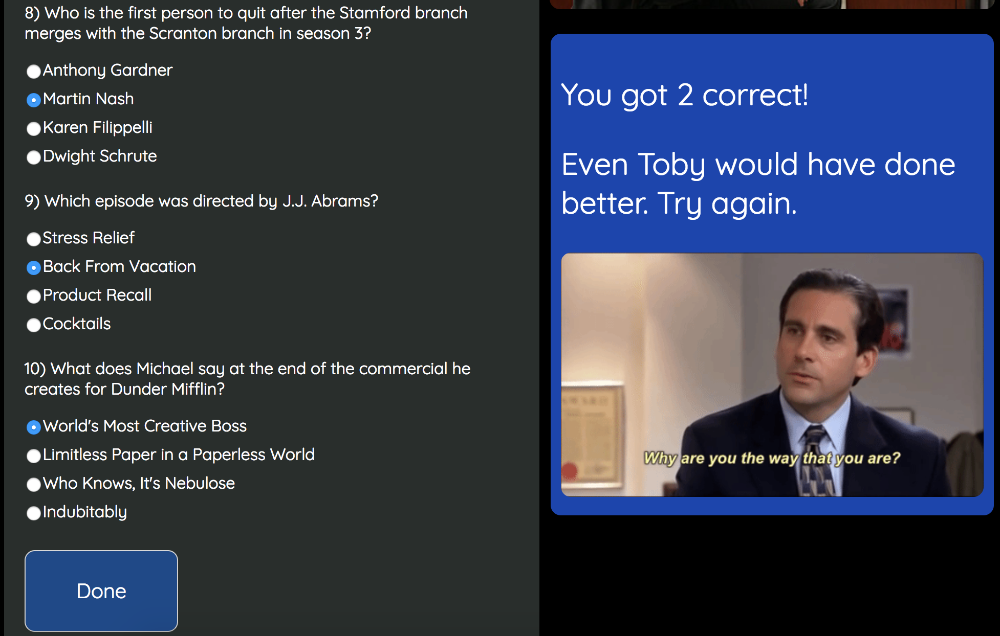

This is a fun trivia game for fans of the TV show "The Office."

For this project, I used HTML, CSS, and Javascript.

I created a function check() in my javascript file to cross-reference the correct answers with the answers that the User selected. After clicking "Done," a specific message with a specific gif will appear on the right-hand side of the page, shown below:

Features:

Bronze: 10 functioning questions that, after clicking "Done", provide you with how many you got correct

Silver: Visually appealing with images and clean layout

Gold: Different messages/gifs that appear based on how many questions the User answered correctly

Installation instructions:

Contribution: Users can contribute to my code by 

